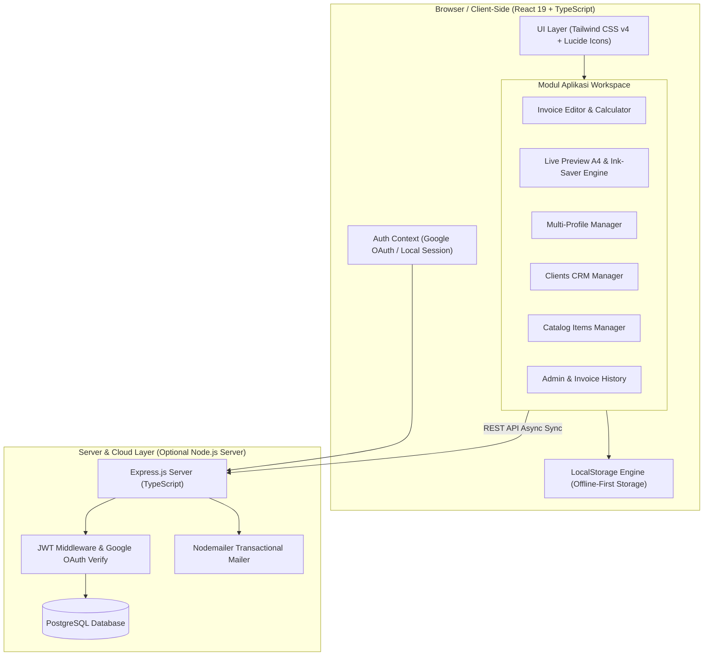
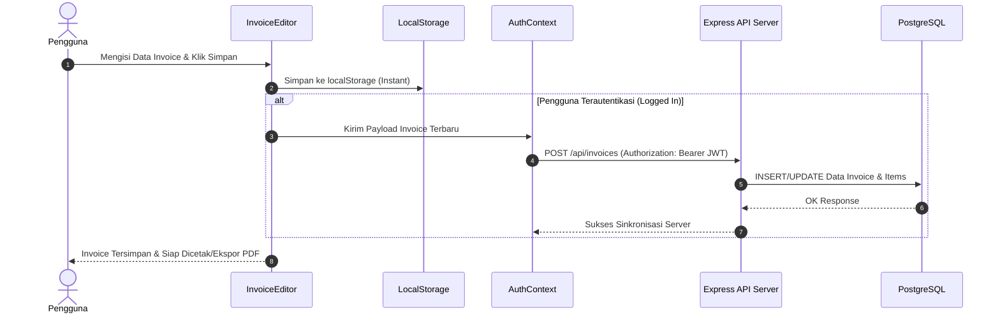

# 🏗️ Arsitektur Sistem Tagih Dong (Invoice Maker)

Selamat datang di dokumentasi arsitektur **Tagih Dong**, platform pembuat invoice bisnis profesional berbasis web yang dirancang khusus untuk UMKM, toko retail, dan freelancer di Indonesia.

---

## 📐 Ringkasan Arsitektur

Tagih Dong dibangun dengan pendekatan **Hybrid Client-First Architecture**. Aplikasi ini dapat berjalan **100% offline & client-side** menggunakan penyimpanan `localStorage` browser, atau terintegrasi dengan **Backend REST API + PostgreSQL** untuk persistensi multi-perangkat dan sinkronisasi akun.



---

## 🛠️ Stack Teknologi

| Komponen | Teknologi | Deskripsi & Versi |
|---|---|---|
| **Frontend Core** | React 19 + TypeScript 6.0 | Framework UI reaktif modern dengan type safety ketat |
| **Build Tooling** | Vite 8.1 | Build tool kilat dengan HMR (Hot Module Replacement) |
| **Styling & UI** | Tailwind CSS v4.3 + Lucide React | Framework CSS utility-first dan icon set modern |
| **Penyimpanan Lokal** | Browser `localStorage` | Persistensi data lokal tanpa ketergantungan server |
| **Canvas & Utility** | `qrcode.react`, `canvas-confetti` | Generator QR Code QRIS dan efek animasi perayaan |
| **Backend Server** | Node.js + Express.js | Server REST API (di folder `server/`) |
| **Database** | PostgreSQL 15+ | DBMS relasional untuk persistensi data server-side |
| **Autentikasi** | Google OAuth 2.0 + JWT | Login Google terverifikasi dengan token JWT 7 hari |
| **Transaksional Email** | Nodemailer | Pengiriman email welcome & notifikasi invoice |
| **Linter & Quality** | OXLint | Linter berkecepatan tinggi untuk standar kualitas kode |

---

## 🧩 Struktur Komponen Frontend

Aplikasi frontend berpusat di folder `src/` dengan struktur modular sebagai berikut:

```
src/
├── assets/                     # Asset statis & logo
├── components/
│   ├── Auth/                   # Modal Login Google & Settings Akun
│   │   ├── GoogleLoginModal.tsx
│   │   └── UserSettingsModal.tsx
│   ├── Catalog/                # Manajemen Katalog Produk/Jasa
│   │   └── ItemCatalogManager.tsx
│   ├── Clients/                # CRM & Database Klien
│   │   └── ClientManager.tsx
│   ├── Dashboard/              # Riwayat & Filter Invoice
│   │   └── InvoiceList.tsx
│   ├── InvoiceEditor/          # Form Input & Kalkulasi Invoice
│   │   ├── InvoiceForm.tsx
│   │   ├── CatalogSelectorModal.tsx
│   │   ├── ClientSelectorModal.tsx
│   │   └── ThemeTemplatePicker.tsx
│   ├── InvoicePreview/         # Pratinjau A4 & Cetak PDF
│   │   ├── InvoicePaper.tsx
│   │   ├── SignatureCanvas.tsx
│   │   └── templates/          # 23+ Varian Template Invoice
│   ├── Profiles/               # Multi-Profil Bisnis/Usaha
│   │   └── ProfileManager.tsx
│   ├── SaaS/                   # Landing Page, Pricing, Support & Admin
│   │   ├── LandingPage.tsx
│   │   ├── AdminDashboard.tsx
│   │   ├── PricingModal.tsx
│   │   └── SupportModal.tsx
│   ├── UI/                     # UI Reusable (Modal, Button, Input, Badges)
│   ├── Header.tsx              # Header Utama & Quick Switcher
│   └── Navigation.tsx          # Tab Bar Navigation Workspace
├── constants/
│   └── templates.ts            # Metadatas 23+ Template Invoice
├── context/
│   └── AuthContext.tsx         # Context Auth (Session, User State, Dual-Mode)
├── i18n/
│   └── translations.ts         # Kamus Terjemahan Indonesia (ID) & Inggris (EN)
├── styles/                     # Modul CSS Tambahan
├── types/
│   └── index.ts                # TypeScript Interfaces & Definitions
└── utils/
    ├── formatters.ts           # Helper Mata Uang, Tanggal, & Auto Invoice No.
    └── storage.ts              # Abstraksi Pembacaan & Penulisan LocalStorage
```

---

## 💾 Model Alir Data & Persistensi (Dual-Mode)

Tagih Dong mendukung dua skenario penggunaan:

### 1. Offline / Standalone Mode (Default)
- Semua data invoice, profil bisnis, klien, dan katalog disimpan di `localStorage`.
- Pembacaan dan penulisan dilakukan secara instan melalui modul [storage.ts](file:///c:/Project/invoice-maker/src/utils/storage.ts).
- Tidak memerlukan koneksi internet maupun registrasi akun.

### 2. Cloud-Synced Mode (Google Login)
- Ketika pengguna menekan **"Masuk dengan Google"**, `AuthContext` menerima kredensial Google.
- Token diverifikasi di server Express (`POST /api/auth/google`).
- Data lokal pengguna di-sinkronkan ke database PostgreSQL.
- Sesi ditandai dengan token JWT yang disimpan secara aman di header HTTP request.



---

## 🖨️ Engine Cetak A4 & Ink-Saver

Salah satu inovasi utama Tagih Dong adalah optimasi cetak ramah tinta untuk UMKM:

1. **Ukuran Presisi A4**: Menggunakan styling CSS `@media print` dan rasio tinggi-lebar standar kearsipan (210mm x 297mm).
2. **Ink-Saver Engine**: Seluruh template dirancang dengan dominasi elemen berbasis latar putih dan garis tepi tipis (*contrast borders*), menghemat penggunaan toner/tinta printer hingga **70%** dibanding template warna blok pekat.
3. **Ekspor PDF Tanpa Server**: Menggunakan fitur bawaan browser `window.print()` yang langsung mengkonversi layout dokumen menjadi file PDF resolusi tinggi tanpa watermark.

---

## 🛡️ Keamanan & Akses Terkontrol (RBAC)

Aplikasi memiliki dua tingkatan otorisasi utama:

1. **User Regular**:
   - Berhak membuat, mengedit, dan mengelola invoice, profil bisnis, klien, dan katalog milik mereka sendiri.
   - Hanya memiliki akses ke data dengan `user_id` milik sendiri.

2. **Super Admin**:
   - Dikhususkan untuk email terdaftar (misal: `99apps.id@gmail.com`, `support@99apps.id`).
   - Dapat mengakses **Admin Dashboard** (`/admin`).
   - Memiliki hak akses ringkasan metrik platform dan data pengguna.

---

## 🌐 Internasionalisasi (i18n)

Aplikasi mendukung pengubahan bahasa secara dinamis (*real-time switch*) antara Bahasa Indonesia 🇮🇩 dan Bahasa Inggris 🇬🇧:
- Dikelola oleh modul [translations.ts](file:///c:/Project/invoice-maker/src/i18n/translations.ts).
- Pilihan bahasa tersimpan di `localStorage` dan langsung mengubah seluruh label UI, nama status invoice, dan istilah pajak secara otomatis.
