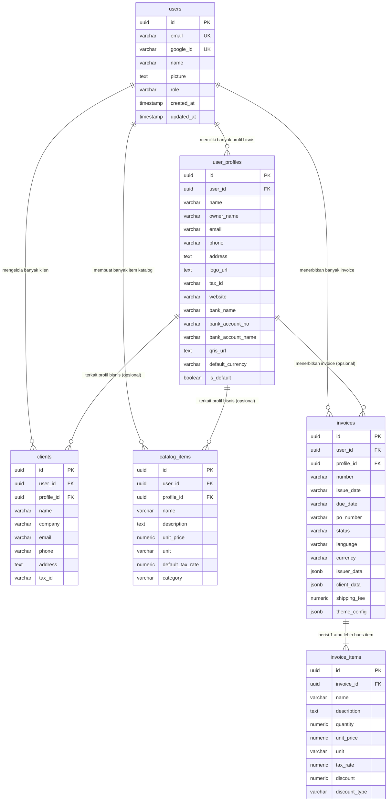

# 🗄️ Dokumentasi Skema Basis Data PostgreSQL

Dokumen ini menjelaskan struktur basis data PostgreSQL yang digunakan oleh server backend aplikasi **Tagih Dong**. Skema ini dirancang untuk mendukung sistem **multi-tenant / multi-user** dengan fleksibilitas identitas usaha ganda.

---

## 📊 Entity Relationship Diagram (ERD)



---

## 📋 Spesifikasi Tabel

### 1. Tabel `users`
Menyimpan akun pengguna yang terdaftar melalui Google OAuth 2.0.

| Kolom | Tipe Data | Constraint | Deskripsi |
|---|---|---|---|
| `id` | `UUID` | `PRIMARY KEY`, Default `uuid_generate_v4()` | Unique Identifier pengguna |
| `email` | `VARCHAR(255)` | `UNIQUE`, `NOT NULL` | Alamat email terdaftar |
| `google_id` | `VARCHAR(255)` | `UNIQUE`, `NOT NULL` | ID sub unik dari Google OAuth |
| `name` | `VARCHAR(255)` | `NOT NULL` | Nama lengkap pengguna |
| `picture` | `TEXT` | `NULLABLE` | URL avatar foto profil |
| `role` | `VARCHAR(50)` | Default `'user'` | Role otorisasi (`user` / `admin`) |
| `created_at` | `TIMESTAMPTZ` | Default `CURRENT_TIMESTAMP` | Waktu pendaftaran |
| `updated_at` | `TIMESTAMPTZ` | Default `CURRENT_TIMESTAMP` | Waktu pembaruan profil |

---

### 2. Tabel `user_profiles`
Menyimpan identitas usaha/bisnis milik pengguna (Multi-Profile per akun).

| Kolom | Tipe Data | Constraint | Deskripsi |
|---|---|---|---|
| `id` | `UUID` | `PRIMARY KEY`, Default `uuid_generate_v4()` | ID unik profil usaha |
| `user_id` | `UUID` | `REFERENCES users(id) ON DELETE CASCADE` | ID pemilik profil |
| `name` | `VARCHAR(255)` | `NOT NULL` | Nama Toko / PT / CV / Studio |
| `owner_name` | `VARCHAR(255)` | `NULLABLE` | Nama penanggung jawab / pemilik |
| `email` | `VARCHAR(255)` | `NULLABLE` | Email bisnis |
| `phone` | `VARCHAR(100)` | `NULLABLE` | Nomor HP/WhatsApp bisnis |
| `address` | `TEXT` | `NULLABLE` | Alamat fisik toko/kantor |
| `logo_url` | `TEXT` | `NULLABLE` | URL logo usaha |
| `tax_id` | `VARCHAR(100)` | `NULLABLE` | NPWP / Tax Registration No. |
| `website` | `VARCHAR(255)` | `NULLABLE` | URL website usaha |
| `bank_name` | `VARCHAR(100)` | `NULLABLE` | Nama Bank (BCA, Mandiri, BRI, dll.) |
| `bank_account_no` | `VARCHAR(100)` | `NULLABLE` | Nomor rekening bank |
| `bank_account_name` | `VARCHAR(255)` | `NULLABLE` | Nama pemilik rekening |
| `swift_code` | `VARCHAR(50)` | `NULLABLE` | Kode SWIFT/BIC untuk transfer luar negeri |
| `qris_url` | `TEXT` | `NULLABLE` | URL gambar QR Code QRIS statis |
| `default_currency` | `VARCHAR(10)` | Default `'IDR'` | Mata uang default (IDR, USD, EUR, dll.) |
| `business_type` | `VARCHAR(50)` | Default `'general'` | Jenis usaha (Retail, Services, Freelance) |
| `is_default` | `BOOLEAN` | Default `false` | Profil default saat membuat invoice baru |
| `created_at` | `TIMESTAMPTZ` | Default `CURRENT_TIMESTAMP` | Timestamp pembuatan |
| `updated_at` | `TIMESTAMPTZ` | Default `CURRENT_TIMESTAMP` | Timestamp pembaruan |

---

### 3. Tabel `clients`
Database pelanggan/klien (CRM).

| Kolom | Tipe Data | Constraint | Deskripsi |
|---|---|---|---|
| `id` | `UUID` | `PRIMARY KEY`, Default `uuid_generate_v4()` | ID unik klien |
| `user_id` | `UUID` | `REFERENCES users(id) ON DELETE CASCADE` | Pemilik data klien |
| `profile_id` | `UUID` | `REFERENCES user_profiles(id) ON DELETE SET NULL` | Profil usaha terkait (opsional) |
| `name` | `VARCHAR(255)` | `NOT NULL` | Nama kontak klien |
| `company` | `VARCHAR(255)` | `NULLABLE` | Nama perusahaan/organisasi klien |
| `email` | `VARCHAR(255)` | `NULLABLE` | Email klien |
| `phone` | `VARCHAR(100)` | `NULLABLE` | Nomor HP / Telepon klien |
| `address` | `TEXT` | `NULLABLE` | Alamat penagihan |
| `tax_id` | `VARCHAR(100)` | `NULLABLE` | NPWP Klien |

---

### 4. Tabel `catalog_items`
Katalog barang & jasa reusable.

| Kolom | Tipe Data | Constraint | Deskripsi |
|---|---|---|---|
| `id` | `UUID` | `PRIMARY KEY`, Default `uuid_generate_v4()` | ID item katalog |
| `user_id` | `UUID` | `REFERENCES users(id) ON DELETE CASCADE` | Pemilik item |
| `profile_id` | `UUID` | `REFERENCES user_profiles(id) ON DELETE SET NULL` | Profil terkait |
| `name` | `VARCHAR(255)` | `NOT NULL` | Nama barang atau jasa |
| `description` | `TEXT` | `NULLABLE` | Deskripsi rincian item |
| `unit_price` | `NUMERIC(15, 2)` | Default `0` | Harga satuan |
| `unit` | `VARCHAR(50)` | Default `'pcs'` | Satuan (pcs, jam, hari, paket, dll.) |
| `default_tax_rate`| `NUMERIC(5, 2)` | Default `11` | Tarif pajak PPN default (%) |
| `category` | `VARCHAR(20)` | Default `'product'` | Jenis item (`product` / `service`) |

---

### 5. Tabel `invoices` & `invoice_items`
Tabel utama dokumen invoice dan rincian itemnya.

#### Tabel `invoices`
- `id` (`UUID` PK)
- `user_id` (`UUID` FK ke `users`)
- `profile_id` (`UUID` FK ke `user_profiles`)
- `number` (`VARCHAR(100)` NOT NULL): Nomor invoice (misal: `INV/2026/07/001`)
- `issue_date` & `due_date` (`VARCHAR(50)` NOT NULL): Tanggal terbit & jatuh tempo
- `po_number` (`VARCHAR(100)`): Nomor Purchase Order
- `status` (`VARCHAR(50)`): `draft`, `pending`, `paid`, `overdue`
- `language` (`VARCHAR(10)`): `id` / `en`
- `currency` (`VARCHAR(10)`): `IDR`, `USD`, `EUR`, `SGD`, `GBP`, `AUD`, `JPY`
- `issuer_data` & `client_data` (`JSONB` NOT NULL): Snapshot data penerbit & penerima invoice
- `shipping_fee` (`NUMERIC(15,2)`): Biaya pengiriman
- `theme_config` (`JSONB` NOT NULL): Snapshot warna, font, dan ID template (misal: `modern`, `corporate`, `luxury`)

#### Tabel `invoice_items`
- `id` (`UUID` PK)
- `invoice_id` (`UUID` FK ke `invoices` ON DELETE CASCADE)
- `name` (`VARCHAR(255)` NOT NULL)
- `description` (`TEXT`)
- `quantity` (`NUMERIC(10,2)` Default `1`)
- `unit_price` (`NUMERIC(15,2)` Default `0`)
- `unit` (`VARCHAR(50)` Default `'pcs'`)
- `tax_rate` (`NUMERIC(5,2)` Default `0`)
- `discount` (`NUMERIC(15,2)` Default `0`)
- `discount_type` (`VARCHAR(20)` Default `'percent'`)

---

## ⚡ Indeks & Optimasi Performa

Untuk mempercepat query pembacaan data multi-tenant, indeks PostgreSQL dipasang pada foreign key `user_id`:

```sql
CREATE INDEX IF NOT EXISTS idx_user_profiles_user_id ON user_profiles(user_id);
CREATE INDEX IF NOT EXISTS idx_clients_user_id ON clients(user_id);
CREATE INDEX IF NOT EXISTS idx_catalog_items_user_id ON catalog_items(user_id);
CREATE INDEX IF NOT EXISTS idx_invoices_user_id ON invoices(user_id);
```
