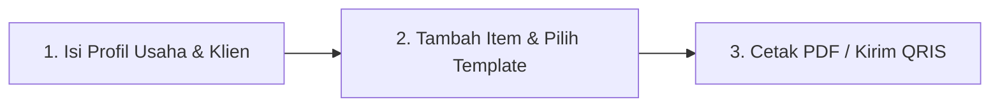

# 📖 Panduan Pengguna Tagih Dong (Invoice Maker)

Selamat datang di **Panduan Pengguna Tagih Dong**. Dokumen ini berisi petunjuk penggunaan langkah demi langkah aplikasi pembuat invoice bisnis profesional.

---

## 🎯 Mulai Cepat: Buat Invoice dalam 3 Langkah

### Langkah 1: Isi Data Usaha & Pilih Klien
1. Buka aplikasi **Tagih Dong** di browser Anda.
2. Di bagian atas form **Penerbit Invoice**, masukkan nama toko/usaha, alamat, nomor telepon, dan logo bisnis Anda.
3. Di bagian **Tujuan Penagihan (Klien)**, isi nama pelanggan, perusahaan, dan alamat penagihan. Anda juga bisa menekan tombol **"Pilih Klien"** untuk mengambil data dari CRM.

### Langkah 2: Tambah Item & Pilih Template
1. Pada tabel **Rincian Barang & Jasa**, masukkan nama produk, jumlah (*quantity*), harga satuan, dan diskon.
2. Tekan tombol **"Pilih dari Katalog"** jika ingin memasukkan item yang sudah tersimpan.
3. Di panel sebelah kanan atau bagian **Pilih Template**, pilih salah satu dari **23+ Template Profesional** (seperti *Modern Cyan*, *Corporate Navy*, *Swiss Grid*, atau *Luxury Gold Leaf*).

### Langkah 3: Cetak PDF & Ekspor
1. Periksa hasil akhir pada tampilan **Pratinjau Live A4** di sebelah kanan.
2. Tekan tombol **"Cetak / Download PDF"** di header atas.
3. Pilih opsi **"Save as PDF"** di dialog cetak browser — invoice profesional siap dikirim ke klien tanpa watermark!

---

## 🧾 Panduan Fitur Utama

### 🎨 1. Pembuatan Invoice & 23+ Template
- **Format Nomor Invoice Otomatis**: Aplikasi secara otomatis menyusun format nomor seperti `INV/2026/07/001`. Anda dapat mengubah format awalan (*prefix*) di pengaturan profil.
- **Dukungan Multi-Mata Uang**: Pilih mata uang transaksi:
  - 🇮🇩 **IDR** (Rupiah Indonesia)
  - 🇺🇸 **USD** (US Dollar)
  - 🇪🇺 **EUR** (Euro)
  - 🇸🇬 **SGD** (Singapore Dollar)
  - 🇬🇧 **GBP** (British Pound)
  - 🇦🇺 **AUD** (Australian Dollar)
  - 🇯🇵 **JPY** (Japanese Yen)
- **Kalkulasi Pajak & Biaya**: Subtotal, PPN/Pajak Kustom, Diskon Persen/Nominal, dan Biaya Pengiriman dihitung secara presisi secara real-time.

---

### 🖨️ 2. Ink-Saver Engine (Cetak Hemat Tinta)
- Seluruh template Tagih Dong menggunakan prinsip **Ink-Saver**.
- Latar belakang putih bersih meminimalkan penggunaan tinta printer hingga **70%** lebih hemat dibanding template warna blok pekat.
- Sangat cocok untuk dicetak di kertas HVS A4 standar di toko retail atau kantor UMKM.

---

### 📱 3. Pembayaran QRIS Instan
1. Pada form editor, scroll ke bagian **Pengaturan Pembayaran & QRIS**.
2. Unggah foto / gambar barcode **QRIS Statis** milik bisnis Anda (BCA Mobile, GoPay, OVO, ShopeePay, DANA, Livin', dll.).
3. Barcode QRIS akan otomatis ditampilkan di pojok bawah invoice. Klien cukup memindai (*scan*) barcode langsung dari ponsel mereka untuk membayar tagihan.

---

### ✍️ 4. Tanda Tangan Digital
Tagih Dong menyediakan dua cara untuk menambahkan tanda tangan pada invoice:
- **Canvas Tanda Tangan**: Gambar tanda tangan langsung menggunakan mouse atau layar sentuh ponsel/tablet.
- **Upload File Gambar**: Unggah file PNG/JPG tanda tangan yang sudah transparan.

---

### 🏢 5. Manajemen Multi-Profil Usaha
Jika Anda memiliki lebih dari satu lini bisnis (misalnya: *Studio Desain* dan *Toko Sepatu*):
1. Klik nama profil di header atas.
2. Pilih **"Kelola Profil Usaha"** -> **"Tambah Profil Baru"**.
3. Setiap profil memiliki logo, data bank, QRIS, serta daftar invoice tersendiri. Anda dapat berpindah antar profil cukup dengan **1-klik**.

---

### 👥 6. CRM Klien & Katalog Produk
- **CRM Klien**: Simpan data pelanggan tetap (Nama, Perusahaan, Email, No HP, Alamat). Saat membuat invoice baru, cukup klik **"Pilih Klien"** untuk otomatis mengisi seluruh form.
- **Katalog Produk/Jasa**: Simpan daftar produk atau tarif jasa langganan. Tekan **"Pilih dari Katalog"** di form invoice untuk memasukkan item beserta harganya secara instan.

---

### 🛡️ 7. Admin Dashboard (Super Admin)
Bagi pengguna berstatus **Super Admin** (email terdaftar seperti `99apps.id@gmail.com`):
- Akses menu **Admin Dashboard** melalui header.
- **Metrik Utama**: Ringkasan total pengguna terdaftar, total invoice diterbitkan, akumulasi nilai transaksi tagihan, dan profil aktif.
- **Manajemen User**: Lihat daftar pengguna, ubah role pengguna, atau lakukan penangguhan (*suspend*).
- **Manajemen Invoice Global**: Cari, filter berdasarkan status/tanggal, dan ekspor data seluruh invoice ke file CSV.
- **Pengaturan Sistem**: Aktifkan *Maintenance Mode*, setel default *Ink-Saver Engine*, dan ubah pesan pengumuman platform.

---

## ❓ Pertanyaan Umum (FAQ)

#### Q: Apakah Tagih Dong benar-benar 100% Gratis?
> **Ya!** Seluruh fitur pembuatan invoice, ekspor PDF A4 tanpa watermark, barcode QRIS, dan template profesional dapat digunakan 100% gratis tanpa biaya tersembunyi.

#### Q: Di mana data invoice saya disimpan?
> Jika Anda menggunakan aplikasi tanpa login, data disimpan dengan aman di penyimpanan lokal browser Anda (`localStorage`). Jika Anda masuk dengan **Google OAuth**, data Anda akan disinkronkan secara aman ke basis data cloud sehingga bisa diakses dari perangkat lain.

#### Q: Bagaimana cara menyimpan invoice sebagai file PDF?
> Tekan tombol **"Cetak / Download PDF"**. Pada tampilan dialog pencetakan browser, ubah *Destination/Tujuan* dari mesin printer fisik menjadi **"Save as PDF"** / **"Simpan sebagai PDF"**.
